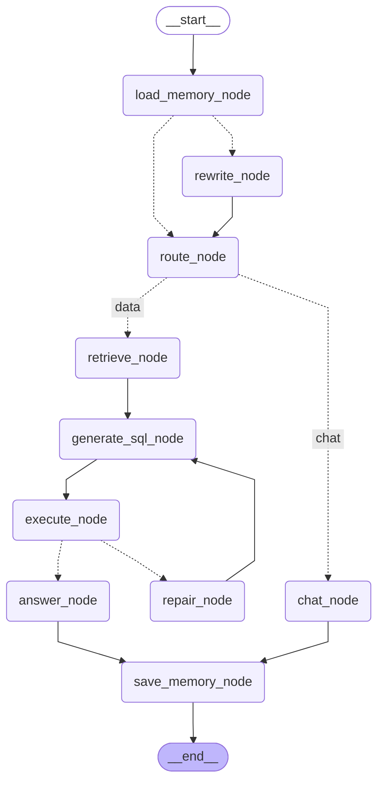

# AskData Agent 流程图

> 在 VSCode 中打开此文件后，按 `Ctrl+Shift+V` 预览（VSCode 内置 Markdown 预览支持 Mermaid 渲染）。
> 此图由 `agent/graph.py` 的 `export_mermaid_diagram()` 从 LangGraph 图结构自动导出，与代码保持同步。

## LangGraph 状态图

## 节点说明

| 节点 | 职责 |
|---|---|
| `load_memory_node` | 加载短期会话历史 + 长期用户偏好 |
| `rewrite_node` | 指代消解（有历史时走此节点，如"那华南呢？"→"华南地区销售额是多少？"） |
| `route_node` | 意图路由：闲聊 / 数据查询 |
| `chat_node` | 闲聊直接回答 |
| `retrieve_node` | 混合检索 schema 字段 + 表关联 + 字段样例值 |
| `generate_sql_node` | 生成 SQL（首次用生成模板，重试用修复模板，注入用户偏好） |
| `execute_node` | DuckDB 只读安全执行 |
| `repair_node` | 重试簿记（attempts+1），环回生成节点——图中可见的自修复环 |
| `answer_node` | 结果转自然语言（失败时诚实报错） |
| `save_memory_node` | 保存会话历史 + 提炼长期偏好 + 滚动摘要检查 |

> 实线 = 固定边；虚线 = 条件边（根据状态动态选择）。
